# Afterglow Plus

This is an extension to [Afterglow](https://github.com/YabataDesign/afterglow-theme) a minimal dark Theme for Sublime Text 2 and 3. Also it is a syntax color scheme. The original theme is based on the great theme [Spacegray](https://github.com/kkga/spacegray). The syntax color scheme is mostly derived from [idlefingers](http://idlefingers.co.uk/).

**Special thanks** to Max Riveiro [@kavu](https://github.com/kavu) for add a lot of icons for sidebar to this repository.

## Design & Colors

I wasn't to happy with the default, that active but unmodified files had no bottom border. So I extended Afterglow with plus-themes.

### Afterglow blue+

#### Active file not modified (clean)

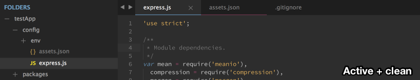

#### Active file modified (dirty) 

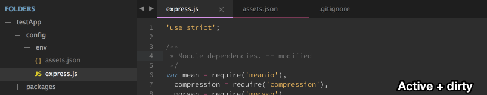


### Afterglow magenta+

#### Active file not modified (clean)

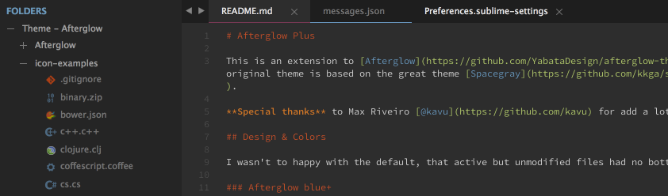

#### Active file modified (dirty)


### Afterglow orange+

#### Active file not modified (clean)

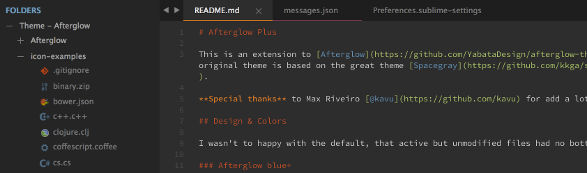

#### Active file modified (dirty)

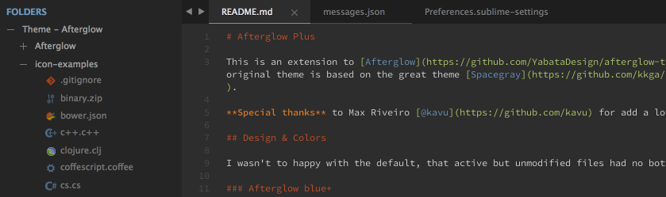


### Afterglow green+

#### Active file not modified (clean)

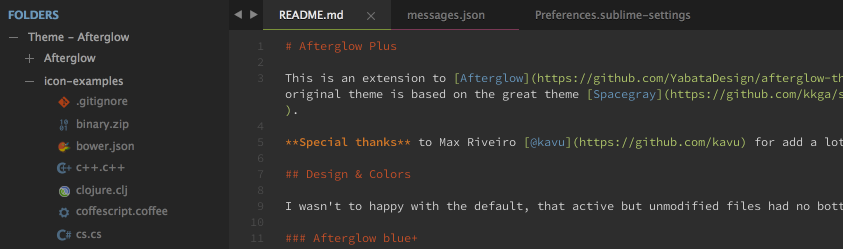


#### Active file modified (dirty)

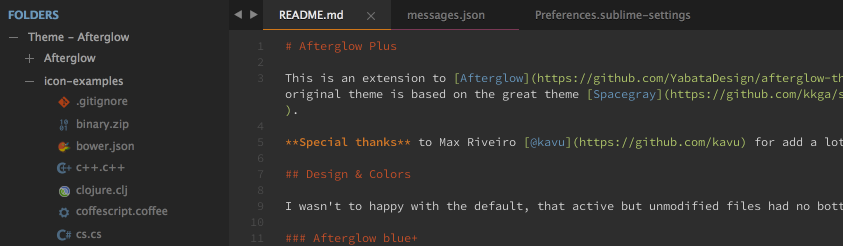


## Installation

### Git Installation

Locate your Sublime Text `Packages directory` by using the menu item `Preferences -> Browse Packages...`.

Then, clone the repository using this command:

    git clone https://github.com/maxxst/afterglow-theme/ "Theme - Afterglow"


### Manual installation

* Download the [GitHub .zip](https://github.com/maxxst/afterglow-theme/archive/master.zip)
* Unzip the files and rename the folder to `Theme - Afterglow`
* Find your `Packages` directory using the menu item  `Preferences -> Browse Packages...`
* Copy the folder into your Sublime Text `Packages` directory.


## Activating the Theme

Activate this theme and color scheme by modifying your user preferences file, which you can find using the menu item `Sublime Text -> Preferences -> Settings - User`.

Then add the following code settings, depending on the theme you choose. **(After activating the theme, you must restart Sublime Text.)**

### Settings for Afterglow-blue

```json
{
    "theme": "Afterglow-blue+.sublime-theme",
    "color_scheme": "Packages/Theme - Afterglow/Afterglow.tmTheme"
}
```

### Settings for Afterglow-magenta

```json
{
    "theme": "Afterglow-magenta+.sublime-theme",
    "color_scheme": "Packages/Theme - Afterglow/Afterglow.tmTheme"
}
```

### Settings for Afterglow-orange

```json
{
    "theme": "Afterglow-orange+.sublime-theme",
    "color_scheme": "Packages/Theme - Afterglow/Afterglow.tmTheme"
}
```

### Settings for Afterglow-green

```json
{
    "theme": "Afterglow-green+.sublime-theme",
    "color_scheme": "Packages/Theme - Afterglow/Afterglow.tmTheme"
}
```


## Configuration

### Sidebar icons

**New:** Now Afterglow theme support sidebar icons.

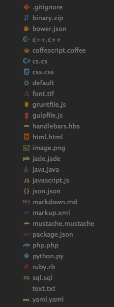

Don't like the icons? Just add this to your preferences file `Sublime Text -> Preferences -> Settings - User`:

```json
{
    "sidebar_no_icon": true
}
```

Don't like the folde icon? Just add this to your preferences file `Sublime Text -> Preferences -> Settings - User`:

```json
{
    "folder_no_icon": true
}
```


### Tab Height Size Options

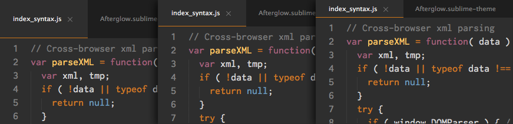

You can change the height of the file tabs (medium or small) by adding either to your preferences file `Sublime Text -> Preferences -> Settings - User`:

```json
{
    "tabs_medium": true
}
```

or

```json
{
    "tabs_small": true
}
```


### Sidebar Size Options

You can change the font size of the sidebar and the row padding.


#### Sidebar font size

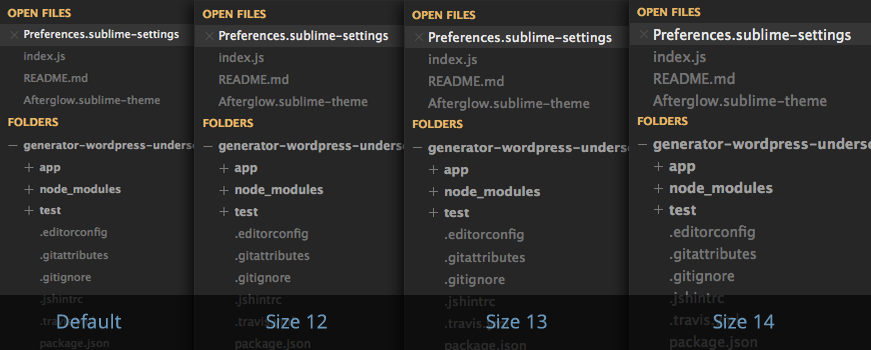

To **change the font size** (12, 13 or 14; default size is 11), you must add this to your preferences file `Sublime Text -> Preferences -> Settings - User`:

```json
{
    "sidebar_size_12": true
}
```

or

```json
{
    "sidebar_size_13": true
}
```

or

```json
{
    "sidebar_size_14": true
}
```


#### Sidebar row padding size

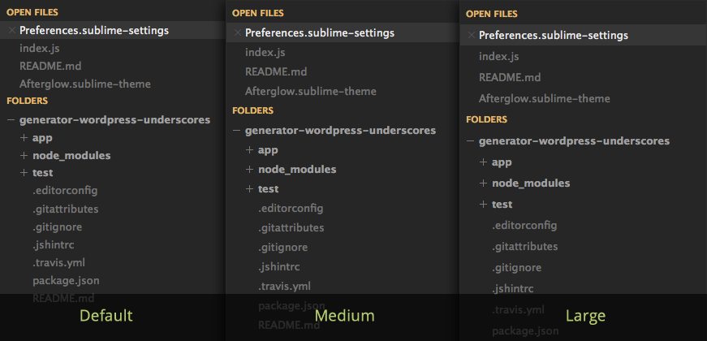

To **change the row padding** (medium or large), you must add this to your preferences file `Sublime Text -> Preferences -> Settings - User`:

```json
{
    "sidebar_row_padding_medium": true
}
```

or

```json
{
    "sidebar_row_padding_large": true
}
```


### Status bar brighter

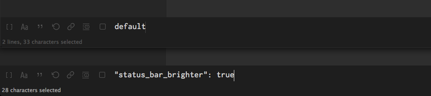

If you prefer that the status bar has a brighter color, you have to add this in your user preferences file `Sublime Text -> Preferences -> Settings - User`:

```json
{
    "status_bar_brighter": true
}
```


### Color inactive tabs

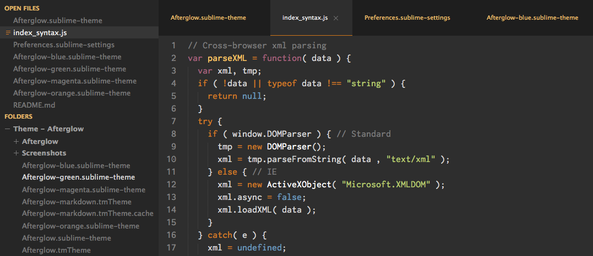

You can highlight the color of inactive tabs, adding this to the user preferences file `Sublime Text -> Preferences -> Settings - User`:

```json
{
    "color_inactive_tabs": true
}
```


### Horizontal padding tabs

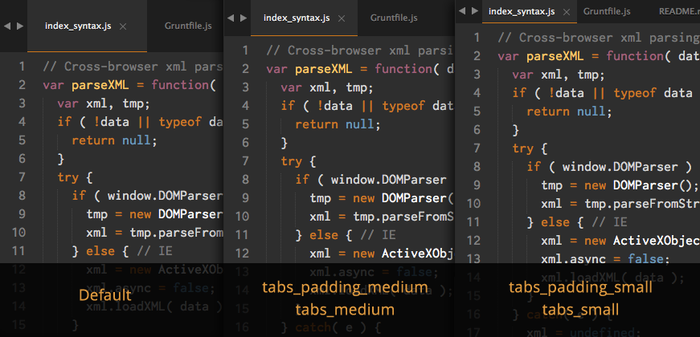

Through the user preferences file, you can modify the horizontal padding of tabs. It works on all three types of height tabs (default, "tabs_medium" and "tabs_small").

You must add this to your user preferences file `Sublime Text -> Preferences -> Settings - User`:

```json
{
    "tabs_padding_medium": true
}
```

or

```json
{
    "tabs_padding_small": true
}
```

### Non-italic tab labels on Windows

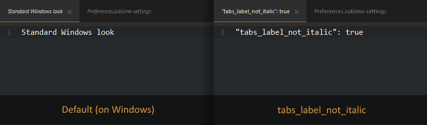

On Windows, tab labels are displayed in *italic* font. If you don't like that, you can add this to the user preferences file `Sublime Text -> Preferences -> Settings - User`:

```json
{
    "tabs_label_not_italic": true
}
```


## Color schemes

### Afterglow - Monokai

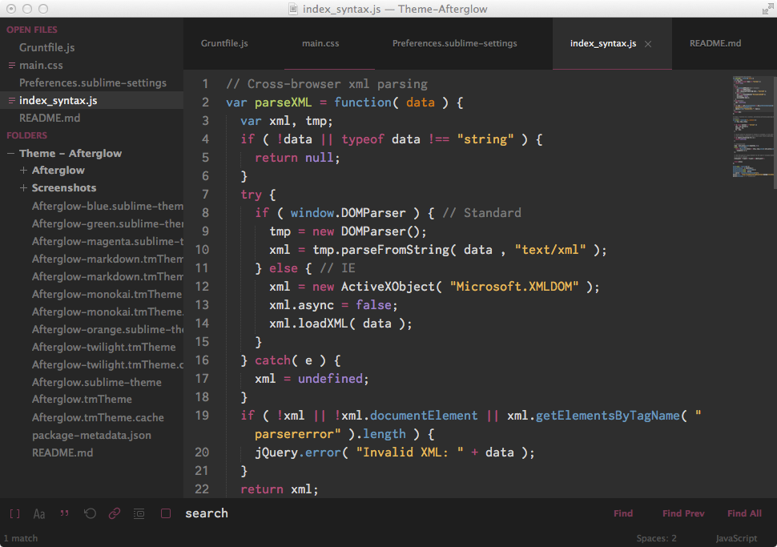

Besides color scheme by default, you can use the color scheme `Afterglow - Monokai` based on the original `Monokai`, slightly modified to be consistent with the Theme colors.

You must add this in your user preferences file `Sublime Text -> Preferences -> Settings - User`:

```json
{
    "color_scheme": "Packages/Theme - Afterglow/Afterglow-monokai.tmTheme"
}
```


### Afterglow - Twilight

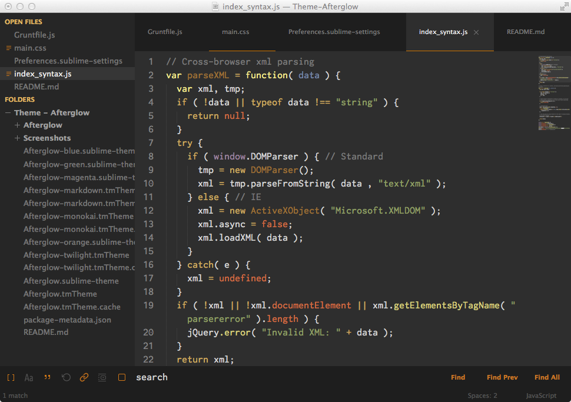

If you prefer, you can use the color scheme `Afterglow - Twilight` (very slightly modified from the original), adding this to the user preferences file `Sublime Text -> Preferences -> Settings - User`:

```json
{
    "color_scheme": "Packages/Theme - Afterglow/Afterglow-twilight.tmTheme"
}
```


### Markdown

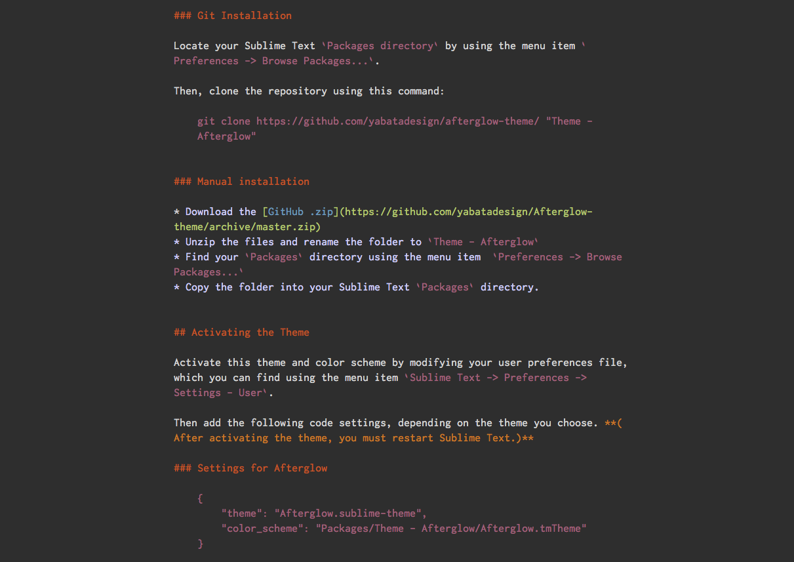

**NEW:** This color scheme support **Github Flavored Markdown**.

#### To enable Afteglow for Markdown

(I highly recommend installing [Sublime Markdown Extending plugin](https://github.com/jonschlinkert/sublime-markdown-extended).)

First, **open a markdown(.md) file**, then navigate to `Sublime Text -> Preferences -> Settings - More -> Syntax Specific - User` in the menu bar.

Add to your current settings or replace with the following:

```json
{
    "color_scheme": "Packages/Theme - Afterglow/Afterglow-markdown.tmTheme",
    "draw_centered": true,
    "draw_indent_guides": false,
    "trim_trailing_white_space_on_save": false,
    "word_wrap": true,
    "wrap_width": 80  // Sets the # of characters per line
}
```


## Dock Icon

You can also download a replacement icon for Sublime Text [here](https://github.com/YabataDesign/sublime-text-icon).


## Retina Resolution UI

Afterglow Theme support retina display.
