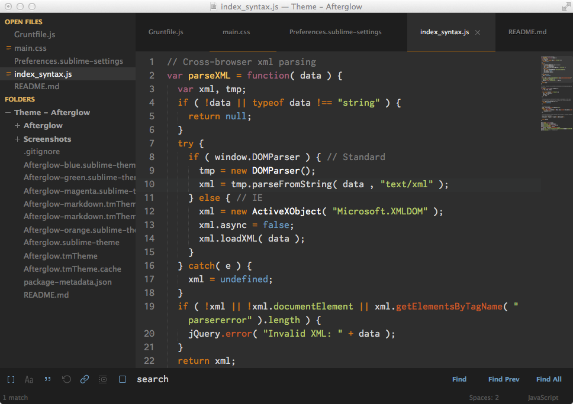
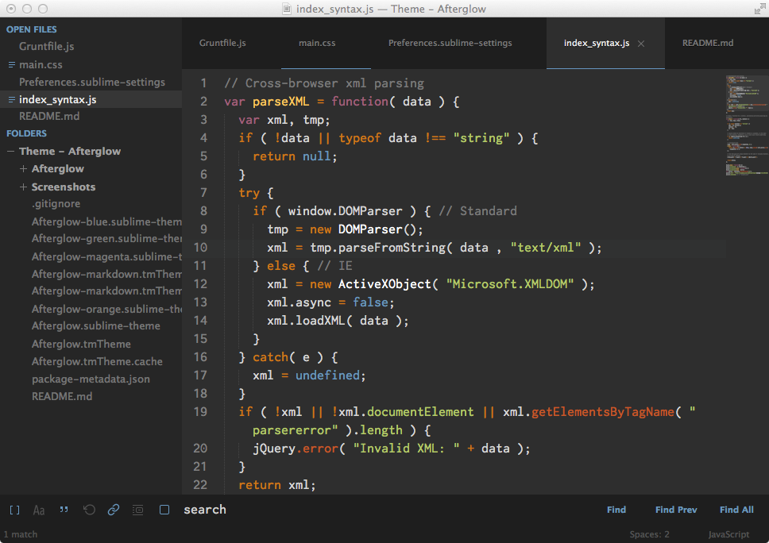
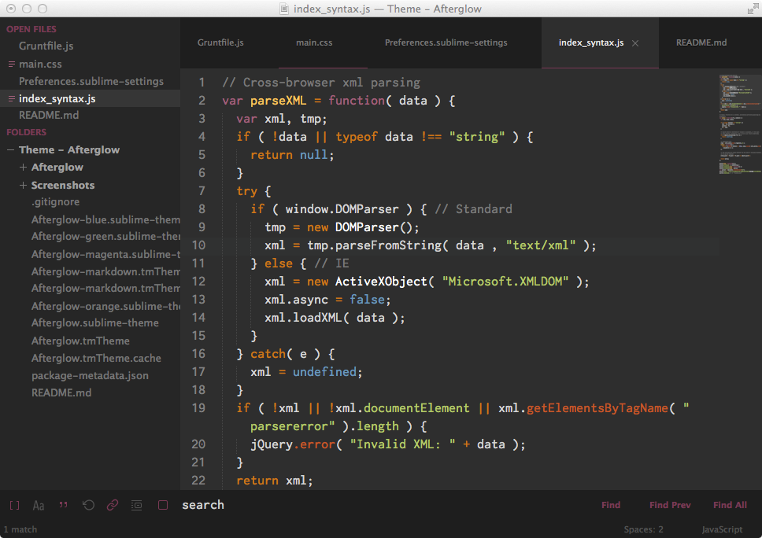
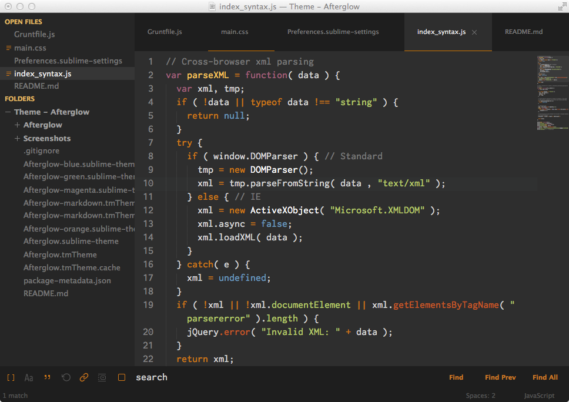
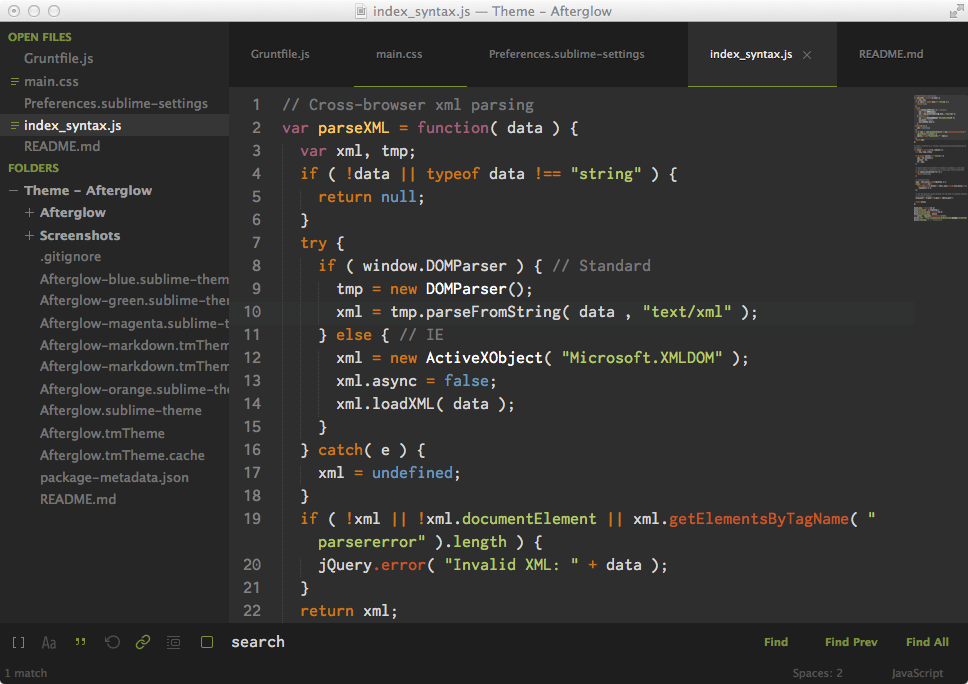

# Afterglow

Afterglow is a minimal dark Theme for Sublime Text 2 and 3. Also it is a syntax color scheme. The theme is based on the great theme [Spacegray](https://github.com/kkga/spacegray). The syntax color scheme is mostly derived from [idlefingers](http://idlefingers.co.uk/).

## Design & Colors

#### Afterglow default

[View a larger screenshot](https://raw.githubusercontent.com/YabataDesign/afterglow-theme/master/Screenshots/Afterglow-default.png)

#### Afterglow blue

[View a larger screenshot](https://raw.githubusercontent.com/YabataDesign/afterglow-theme/master/Screenshots/Afterglow-blue.png)

#### Afterglow magenta

[View a larger screenshot](https://raw.githubusercontent.com/YabataDesign/afterglow-theme/master/Screenshots/Afterglow-magenta.png)

#### Afterglow orange

[View a larger screenshot](https://raw.githubusercontent.com/YabataDesign/afterglow-theme/master/Screenshots/Afterglow-orange.png)

#### Afterglow green

[View a larger screenshot](https://raw.githubusercontent.com/YabataDesign/afterglow-theme/master/Screenshots/Afterglow-green.png)

*The font used in the screenshots is [__Inconsolata -g__](http://leonardo-m.livejournal.com/77079.html).*

## Installation

### Package Control

Comming soon!

### Git Installation

Locate your Sublime Text `Packages directory` by using the menu item `Preferences -> Browse Packages...`.

Then, clone the repository using this command:

    git clone https://github.com/Yabatadesign/afterglow-theme/ "Theme - Afterglow"

### Manual installation

* Download the [GitHub .zip](https://github.com/Yabatadesign/afterglow-theme/archive/master.zip)
* Unzip the files and rename the folder to `Theme - Afterglow`
* Find your `Packages` directory using the menu item  `Preferences -> Browse Packages...`
* Copy the folder into your Sublime Text `Packages` directory.

## Activating the Theme

Activate this theme and color scheme by modifying your user preferences file, which you can find using the menu item `Sublime Text -> Preferences -> Settings - User`.

Then add the following code settings, depending on the theme you choose. **(After activating the theme, you must restart Sublime Text.)**

### Settings for Afterglow

    {
        "theme": "Afterglow.sublime-theme",
        "color_scheme": "Packages/Theme - Afterglow/Afterglow.tmTheme"
    }

### Settings for Afterglow-blue

    {
        "theme": "Afterglow-blue.sublime-theme"
        "color_scheme": "Packages/Theme - Afterglow/Afterglow.tmTheme"
    }

### Settings for Afterglow-magenta

    {
        "theme": "Afterglow-magenta.sublime-theme"
        "color_scheme": "Packages/Theme - Afterglow/Afterglow.tmTheme"
    }

### Settings for Afterglow-orange

    {
        "theme": "Afterglow-orange.sublime-theme"
        "color_scheme": "Packages/Theme - Afterglow/Afterglow.tmTheme"
    }

### Settings for Afterglow-green

    {
        "theme": "Afterglow-green.sublime-theme"
        "color_scheme": "Packages/Theme - Afterglow/Afterglow.tmTheme"
    }

## Markdown

#### To enable Afteglow for Markdown

First, **open a markdown(.md) file**, then navigate to `Sublime Text -> Preferences -> Settings - More -> Syntax Specific - User` in the menu bar.

Add to your current settings or replace with the following:

    {
        "color_scheme": "Packages/Theme - Afterglow/Afterglow-markdown.tmTheme",
        "draw_centered": true,
        "draw_indent_guides": false,
        "trim_trailing_white_space_on_save": false,
        "word_wrap": true,
        "wrap_width": 80  // Sets the # of characters per line
    }

## Dock Icon

You can also download a replacement icon for Sublime Text [here](https://github.com/YabataDesign/sublime-text-icon).

## Retina Resolution UI

Afterglow Theme support retina display.
